# VSCode+Ozone开发STM32的方法

> 所属：士继 DREAMER 战队
> 作者：XunWei
> 编码：UTF-8

<center><b><font face="楷体">neozng1@hnu.edu.cn</font></b></center>

[TOC]

## 前言

了解过嵌入式开发的你一定接触过Keil，这款20世纪风格UI的IDE伴随很多人度过了学习单片机的岁月。然而由于其缺少代码补全、高亮和静态检查的支持，以及为人诟病的一系列逆天的设置、极慢的编译速度（特别是在开发HAL库时），很多开发者开始转向其他IDE。

IAR、CubeIDE等都是广为使用的“其他”IDE，但是他们也有各自的缺点，不能让笔者满意。作为IDE界的艺术家，JetBrains推出的Clion也在相当程度上完善了对嵌入式开发的支持。不过，在体验过多款IDE后，还是**VSCode**这款高度定制化的编辑器最让人满意。强大的补全和snippet以及代码高亮、定义跳转甩KEIL十条街。

而Ozone则是SEGGER(做jilnk的)推出的调试应用，支持变量实时更新，变量曲线可视化，SEGGER RTT日志，DBG虚拟串口等功能，大大扩展了调试的功能。很多人习惯使用串口进行可视化调试，如vofa，串口调试助手等。然而通过这些方式进行调试，都是对内核有**侵入性**的，会占有内核资源并且导致定时器的时间错乱。由于DBG有单独连接到FLASH和CPU寄存器的高速总线（类似于DMA），可以在不影响程序正常运行的情况下以极高的频率直接获取变量值。

下面，将从工具链介绍、环境配置以及调试工作流三个方面介绍以VSCode为编辑器，Ozone为调试接口的开发环境。

开发的大致流程为：

~~~mermaid
graph LR
CubeMX进行初始化 --> VSCode编写代/进行编译/简单调试 --> Ozone变量可视化调试+log
~~~

***本教程不仅希望教会你如何配置环境，同样会告诉你每一步究竟是在做什么，而不是简单的复制黏贴邯郸学步。***

## 前置知识

1. 计算机速成课：[Crash Course Computer Science](https://www.bilibili.com/video/av21376839/?vd_source=ddae2b7332590050afe28928f52f0bda)

2. 从零到一打造一台计算机：

   [编程前你最好了解的基本硬件和计算机基础知识（模拟电路）](https://www.bilibili.com/video/BV1774114798/?spm_id_from=333.788.recommend_more_video.11&vd_source=ddae2b7332590050afe28928f52f0bda)

   [编程前你最好了解的基本硬件和计算机基础知识（数字电路）](https://www.bilibili.com/video/BV1Hi4y1t7zY/?spm_id_from=333.788.recommend_more_video.0)

   [从0到1设计一台计算机](https://www.bilibili.com/video/BV1wi4y157D3/?spm_id_from=333.788.recommend_more_video.0&vd_source=ddae2b7332590050afe28928f52f0bda)

3. C语言基础：[程序设计入门——C语言](https://www.icourse163.org/course/ZJU-199001?from=searchPage&outVendor=zw_mooc_pcssjg_)

***务必学完以上课程再开始本教程的学习，以及后续的开发。***

万丈高楼不可平地而起，地基不牢只会导致递归学习。

> 如果有可能，还应该学习：[哈佛大学公开课：计算机科学cs50](https://open.163.com/newview/movie/courseintro?newurl=%2Fspecial%2Fopencourse%2Fcs50.html)。你将会对单片机和计算机有不同的理解。

## 预备知识

1. C语言从源代码到.bin和.hex等机器代码的编译和链接过程

3. C语言的内存模型

4. C语言标准，动态链接库和静态编译的区别，一些编译器的常用选项

5. STM32F4系列的DBG外设工作原理

6. GDB调试器、硬件调试器和DBG的关系

### 编译全过程

C语言代码由固定的词汇（关键字）按照固定的格式（语法）组织起来，简单直观，程序员容易识别和理解，但是CPU只能识别二进制形式的指令，并且这些指令是和硬件相关的（感兴趣的同学可以搜索**指令集**相关内容）。这就需要一个工具，将C语言代码转换成CPU能够识别的二进制指令，对于我们的x86平台windows下的程序就是.exe后缀的文件；对于单片机，一般来说是.bin或.hex等格式的文件（调试文件包括axf和elf）。

能够完成这个转化过程的工具是一个特殊的软件，叫做**编译器（Compiler）**。常见的编译器包括开源的GNU GCC，windows下微软开发的visual C++，以及apple主导的llvm/clang。编译器能够识别代码中的关键字、表达式以及各种特定的格式，并将他们转换成特定的符号，也就是**汇编语言**（再次注意汇编语言是平台特定的），这个过程称为**编译（Compile）**。

对于单个.c文件，从C语言开始到单片机可识别的.bin文件，一般要经历以下几步：

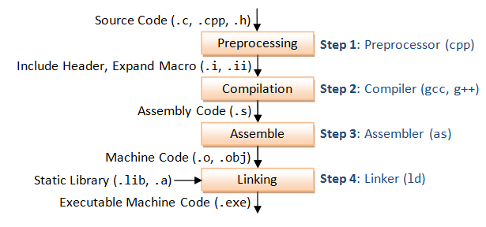

首先是编译**预处理**Preprocessing，这一步会展开宏并删除注释，将多余的空格去除。预处理之后会生成.i文件。

然后，开始**编译**Compilation的工作。编译器会将源代码进行语法分析、词法分析、语义分析等，根据编译设置进行性能优化，然后生成汇编代码.s文件。汇编代码仍然是以助记符的形式记录的文本，比如将某个地址的数据加载到CPU寄存器等，还需要进一步翻译成二进制代码。

下一步就是进行**汇编**Assemble，编译器会根据汇编助记符和机器代码的查找表将所有符号进行替换，生成.o .obj等文件。但请注意，这些文件并不能直接使用（烧录），我们在编写代码的时候，都会包含一些**库**，因此编译结果应当有多个.o文件。我们还需要一种方法将这些目标文件缝合在一起，使得在遇到函数调用的时候，程序可以正确地跳转到对应的地方执行。

最后一步就由链接器Linker（也称LD）完成，称为**链接**Linking。比如你编写了一个motor.c文件和.h文件，并在main.c中包含了motor.h，使用了后者提供的`MotorControl()`函数。那么，链接器会根据编译器生成.obj文件时留下的函数入口地址，将main.o里的调用映射到生成的motor.o中。链接完成后，就生成了单片机可以识别的可执行文件，通过支持的串口或下载器烧录，便可以运行。

> 另外，上图可以看到左侧的**静态库**，包括`.lib .a`，比如我们在STM32中使用的DSP运算库就是这种文件。他在本质上和.o文件相同，只要你在你编写的源文件中包含了这些库的头文件，链接器就可以根据映射关系找到头文件中声明的函数在库文件的地址。（直接提供库而不是.c文件，就可以防止源代码泄露，因此一些不开源的程序会提供函数调用的头文件和接口具体实现的库；你也可以编写自己的库，感兴趣自行搜索）

链接之后，实际上还要进行不同代码片段的重组、地址重映射，详细的内容请参看：[C/C++语言编译链接过程](https://zhuanlan.zhihu.com/p/88255667)，这篇教程还提供了以GCC为例的代码编译示例。

### C语言内存模型

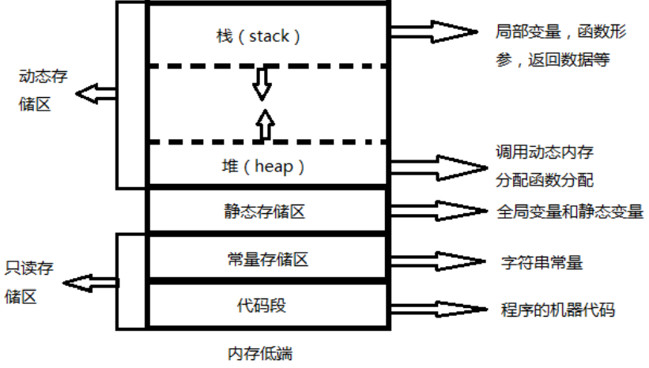

以上是C语言常见的内存模型，即C语言的代码块以及运行时使用的内存（包括函数、变量等）的组织方式。

> 有些平台的图与此相反，栈在最下面（内存低地址），其他区域都倒置，不影响我们理解

**代码段**即我们编写的代码，也就是前面说的编译和链接之后最终生成的可执行文件占据的空间。一些常量，包括字符串和使用`const`关键字修饰的变量被放在常量存储区。`static`修饰的静态变量（包括函数静态变量和文件静态变量）以及全局变量放在常量区上面一点的全局区（也称静态区）。

然后就是最重要的**堆**和**栈**。在一个代码块内定义的变量会被放在栈区，一旦离开作用域（出了它被定义的`{}`的区域），就会立刻被销毁。在调用函数或进入一个用户自定义的`{}`块，都会在栈上开辟一块新的空间，空间的大小和内存分配由操作系统或C库自动管理。**一般来说，直接通过变量访问栈内存，速度最快**（对于单片机）。而堆则是存储程序员自行分配的变量的地方，即使用`malloc(),realloc() ,new`等方法获取的空间，都被分配在这里。

> 在CubeMX初始化的时候，Project mananger标签页下有一个Linker Setting的选项，这里是设置最小堆内存和栈内存的地方。如果你的程序里写了大规模的数组，或使用`malloc()`等分配了大量的空间，可能出现栈溢出或堆挤占栈空间的情况。需要根据MCU的资源大小，设置合适的stack size和heap size。

RTOS创建任务的时候也会为每个任务分配一定的栈空间，它会替代MCU的硬件裸机进行内存的分配。可以在CubeMX中设置。如果一个任务里定义了大量的变量，可能导致实时系统运行异常，请增大栈空间。

> 开发板C型使用F407IG芯片，片上RAM的大小为1MB。

### C language标准和编译器

不同的C语言标准（一般以年份作代号）支持的语法特性和关键字不同，拥有的功能也不同。一般来说语言标准都是向前兼容的，在更新之后仍然会保存前代的基本功能支持（legacy support）。不过，为了程序能够正常运行，我们还需要一些硬件或平台支持的组件。比如`malloc()`这个函数，在linux平台和windows平台上的具体实现就相去甚远，跟单片机更是差了不止一点。前两者一般和对应的操作系统有关，后者在裸机上则是直接通过硬件或ST公司提供的硬件抽象层代码实现。

然而，不同编译器提供的代码实现也不尽相同，比如使用clang和gcc这两种c语言编译器，他们对于一些标准库（也称C库，包括stdio，stdlib，string等在内的实现）的函数的实现就不太一样。再如`__packed`是arm-cc提供的一个字节不对齐关键字，在一些其他编译器中就不支持这种实现。

以前大家常用的KEIL使用的是ARM提供的arm-cc工具链（非常蛋疼，甚至不支持uint8_t=0b00001111这种二进制定义法），而该教程选用的是开源的**Arm GNU Toolchain**。在非目标机且和目标机平台不同的平台上进行开发被成为**跨平台开发**，进行的编译也被成为**交叉编译**（在一个平台上生成另一个平台上的 可执行代码）。

> 工具链包含了编译器，链接器以及调试器等开发常用组件。我们使用的Arm GNU toolchain中，编译器是`arm-none-eabi-gcc.exe`，链接器是`arm-none-eabi-ld.exe`，调试器则是`arm-none-eabi-gdb.exe`。通过跨平台调试器和j-link/st-link/dap-link，我们就可以在自己的电脑上对异构平台（即单片机）的运行进行调试了。

==***特别注意，在新框架中我们使用的是arm-none-eabi-gcc，此编译器不支持`__packed`关键字，若要进行字节压缩（不对齐字节），应该使用预编译指令`#pragma pack(1)`***==。

### Debug外设工作原理

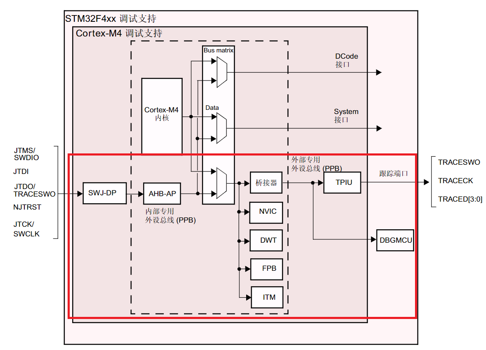

DBG支持模块（红框标注部分，也可以看作一个外设）通过一条专用的AHB-AP总线和调试接口相连（Jtag或swd），并且有与**数据**和**外设**总线直接相连的桥接器。它还同时连接了中断嵌套管理器（因此同样可以捕获中断并进行debug）和ITM、DWT、FPB这些调试支持模块。因此DBG可以直接获取内存或片上外设内的数据而不需要占用CPU的资源，并将这些数据通过专用外设总线发送给调试器，进而在上位机中读取。

FPB是flash patch breakpoint闪存指令断点的缩写，用于提供代码断点插入的支持，当CPU的指令寄存器读取到某一条指令时，FPB会监测到它的动作，并通知TPIU暂停CPU进行现场保护。

DWT是data watch trace数据观察与追踪单元的缩写，用于比较debug变量的大小，并追踪变量值的变化。当你设定了比较断点规则（当某个数据大于/小于某个值时暂停程序）或将变量加入watch进行查看，DWT就会开始工作。DWT还提供了一个额外的计时器，即所有可见的TIM资源之外的另一个硬件计时器（因为调试其他硬件定时器的计时由于时钟变化可能定时不准，而DWT定时器是始终正常运行的）。它用于给自身和其他调试器模块产生的信息打上时间戳。我们的bsp中也封装了dwt计时器，你可以使用它来计时。

ITM是instrument trace macrocell指令追踪宏单元的缩写，它用于提供非阻塞式的日志发送支持（相当于大家常用的串口调试），SEGGER RTT就可以利用这个模块，向上位机发送日志和信息。这个硬件还可以追踪CPU执行的所有指令，这也被称作**trace**（跟踪），并将执行过的指令全部通过调试器发送给上位机。当debug无法定位bug所在的时候，逐条查看cpu执行的指令是一个绝佳的办法，特别是你有大量的中断或开启了实时系统时。

以上三个模块都需要通过TPIU（trace port interface unit）和外部调试器（j-link等）进行连接，TPIU会将三个模块发来的数据进行封装并通过DWT记录时间，发送给上位机。

### GDB调试MCU原理

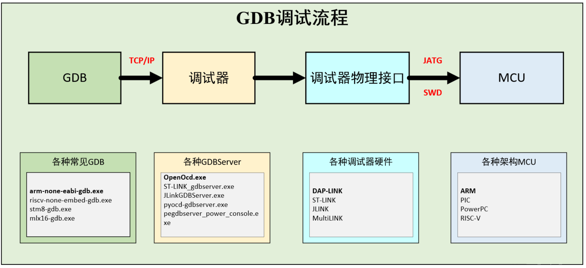

不论使用MDK（KEIL）还是VSCode还是Ozone，实际上背后的流程相同。首先GDB会建立TCP/IP端口并提供接口，调试服务器（Server）作为硬件调试器和GDB软件的桥梁，将硬件调试器的相关功能（也就是DBG外设支持的那些功能）映射到GDB的接口上（通过连接到GDB建立的端口）。之后启动调试，将可执行文件下载到目标MCU上，然后从main开始执行

> 当然你也可以选择从其他启动点开始执行，调试器开始执行的位置叫做**entry point**。同样，在MCU已经正在运行程序的时候，可以**attach**到程序上开始监控（attach=附加，贴上；很形象了）。

> 而对于直接运行在电脑上的程序（.exe），就不需要GDBserver和物理调试器，GDB程序可以直接访问电脑上运行的程序和CPU的寄存器等。

### 字节对齐

这是内存硬件设计和汇编语言设计的结果。在使用结构体的时候，如果你不做任何事情，编译器会自动帮助你完成字节对齐以提高内存访问的效率。stm32是4字节地址和数据总线的设计，单词可以传输32位数据，因此，访问4字节数据（也就是stm32的“字”，“字长”）效率最高。然而，历史的缘由导致一个内存地址只存储8位的数据，如果你要访问float数据，则一次需要读取4个地址。当这四个地址是连续的时候，你只需要一次就可以将数据读出。然而，如果一个float数据被存放在0x03-0x07这四个地址，cpu首先要读出0x00-0x03这四个连续的地址，然后再取出最后一个字节；随后读取0x04-0x07这四个连续的字节，再取出前三个字节；最后将最后一个字节和前三个字节拼接在一起，形成我们需要的float数据。

`#pragma`可能是最复杂的预编译指令，不同的编译器支持不同的`#pragma`指令，如常用的`#pragma once`可以替代header guard。arm gnu gcc编译器支持通过`#pragma pack()`来设置字节对齐，支持的对齐参数包括空/1/2/4/8，会启动对应长度的对齐方式。用于通信的结构体（串口/CAN/spi等外设接收数据的时候都是连续的，不会像结构体一样被编译器对齐）在声明时，采用如下的方式：

```c
#pragma pack(1) // 从这句话开始,使用字节对齐(1),即紧凑,关闭对齐

typedef struct
{
    uint8_t id;
    // ...
    
} CANInstance;

#pragma pack() // 从这里开始,恢复默认配置,一般来说默认配置是 pack(4),如果遇到double/longlong等也会变为8字节对齐
// 使用两个#pragma包裹你的结构体声明
```

如果您有兴趣，可以了解一下内存硬件的组织和连接方式，包括奇偶地址/片选/行列扩展等，可以帮助你更好地理解字节对齐。

## 环境配置

> ***所有需要编辑的配置文件都已经在basic_framework的仓库中提供，如果不会写，照猫画虎。***

- **软件安装**

队伍NAS和资料硬盘内提供了所有必要的依赖,安装包和插件，目录是`/EC/VSCode+Ozone环境配置`，请以公共账号登陆网盘，ip地址为`49.123.113.2:5212`，账号`public@rm.cloud`,密码`public`。

对于非队内的开发者，我们提供了网盘下载方式。所有安装包也可以在此百度网盘链接下获得：[archive.zip](https://pan.baidu.com/s/1sO_EI4cToyIAcScOQx-JSg?pwd=6666)

```shell
# 网盘中的文件:
basic_framework.zip    # 本仓库文件,注意为了保证最新,建议从仓库clone并定时pull（或自动fetch）
daplink_register_license.rar # daplink license注册机
gcc-arm-none-eabi-10.3-2021.10-win32.zip # arm-gnu-toolchain，注意，这个版本太老，编译最新的框架可能出现一些编译参数不支持的情况。请通过Msys2直接安装或到arm官网下载最新的12.x版本。
JLinkARM.dll # 修改过的jlink运行链接库
JLink_Windows_V722b.exe  # JLink软件包
mingw-get-setup.exe  # mingw工具链（更推荐的方式是使用msys2安装）
OpenOCD.zip  # OpenOCD
Ozone_doc.pdf  # Ozone使用手册
Ozone_Windows_V324_x86.exe  # Ozone安装包
VSCodeUserSetup-x64-1.73.1.exe  # VSCode安装包
# 最佳实践是下载msys2并在mingw64中安装软件包！！！
# 如果你喜欢clang，可以使用clang下的arm工具链。
```

> 2022-12-01更新：
>
>  **VSCode上线了一款新的插件：**
>
> 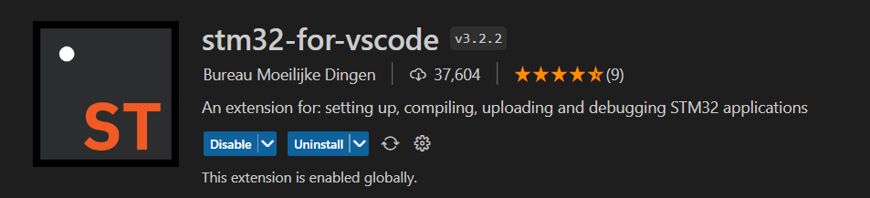
>
> 支持一键配置Arm GNU工具链、MinGW64（make工具）和OpenOCD！可以尝试使用这个插件替代下面的配置流程。并且，此插件还提供了一键下载、一键调试的支持，只需要选择合适的下载器配置即可，全部都是图形化界面的操作！
>
> 你可以尝试使用这个插件进行环境的配置。当然，环境变量仍然需要手动添加。
>
> ==**另外，如果你不想配置太多东西也不想了解底层的信息，可以尝试Embedded IDE插件。它支持直接在VSCode中编辑KEIL MDK的项目，相关信息请自行查阅，或直接查看EIDE的项目网站：**==[https://em-ide.com](https://em-ide.com/)

- 安装STM32CubeMX，并安装F4支持包和DSP库支持包

- 安装VSCode，并安装以下插件：

  - **C/C++**：提供C/C++的调试和代码高亮支持
  - **Better C++ Syntax**：提供更丰富的代码高亮和智能提示
  - **C/C++ Snippets**：提供代码块（关键字）补全
  - **Cortex-Debug**，**Cortex-Debug: Device Support Pack - STM32F4**：提供调试支持。cortex debug还会自动帮助你安装一些调试相关的插件，包括RTOS支持和内存查看等。
  - **IntelliCode**，**Makfile Tools**：提供代码高亮支持。喜欢clang的同学可以使用clangd。

  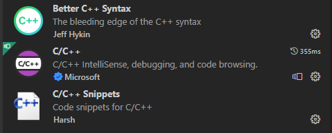

  

  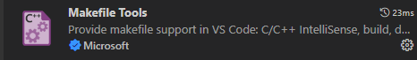

  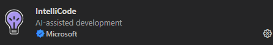

  

  > MinGW、Arm GNU toolchain和OpenOCD也可以通过**MSYS2**使用pacman包管理器（和apt/yum类似）直接安装，这种方法一步到位，**==这是更推荐使用的方式==**，请参看[附录5](##附录5：利用MSYS2安装依赖环境)。
  >
  > **当然，你也可以直接按照下面的方法安装这两个工具。**不过，强烈推荐使用附录5中的方法。下面的方法将在发布完整版更新的时候被删除。

- 安装MinGW，等待界面如下：（will be deprecated soon，请注意这种方法将会在主分支发布正式版的时候删除）

  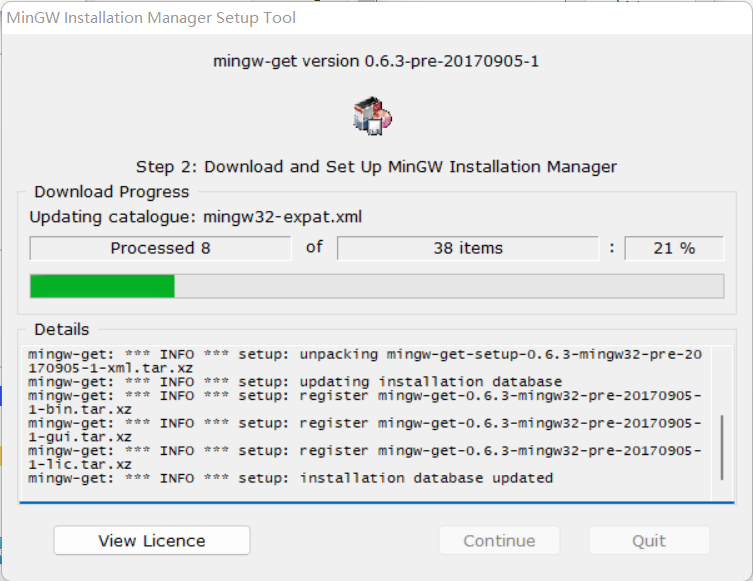

  安装好后，打开MinGW后将所有的支持包勾选，然后安装：

  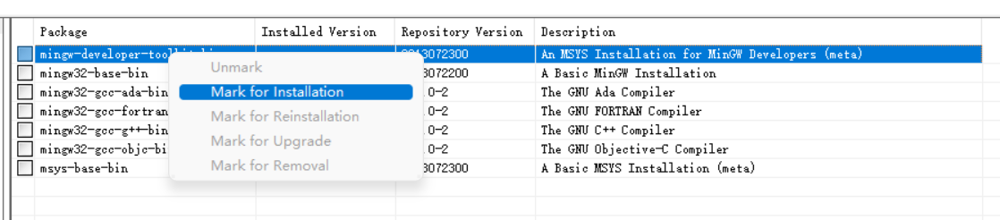

  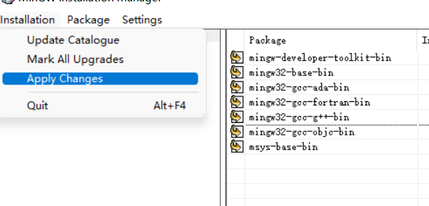

  安装完以后，将MinGW的bin文件夹添加到环境变量中的path下，按下菜单键搜索**编辑系统环境变量**打开之后：

  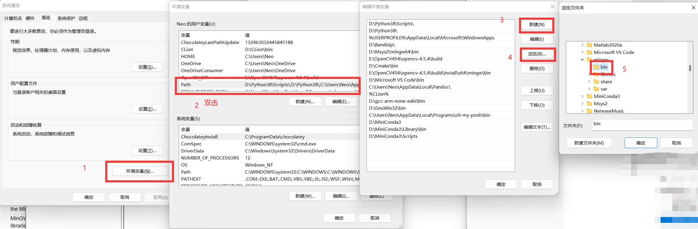

  图片看不清请打开原图。验证安装：

  打开命令行（win+R，cmd，回车），输入`gcc -v`，如果没有报错，并输出了一堆路径和参数说明安装成功。
  
  本工程当前只使用 CMake 构建，不需要额外复制构建工具程序。

  > 当然，更推荐的方式是将MinGW终端集成到VSCode中，防止类linux环境和Win的环境冲突，特别是你的电脑中安装了其他工具链的时候，如MSVC、LLVM等。

- 配置gcc-arm-none-eabi环境变量，**把压缩包解压以后放在某个地方**，然后同上，将工具链的bin添加到PATH：（will be deprecated soon，请注意这种方法将会在主分支发布正式版的时候删除）

  

  <center>安装路径可能不一样，这里要使用你自己的路径而不是直接抄</center>

  验证安装：

  打开命令行，输入`arm-none-eabi-gcc -v`，如果没有报错，并输出了一堆路径和参数说明安装成功。

> 添加到环境变量PATH的意思是，当一些程序需要某些依赖或者要打开某些程序时，系统会自动前往PATH下寻找对应项。**一般需要重启使环境变量生效。**

**若你不希望扰乱系统的环境变量，可以参照附录5将Msys2/MinGW64的终端集成到VSCode中方便开发**。

- **将OpenOCD解压到一个文件夹里**，稍后需要在VSCode的插件中设置这个路径。（will be deprecated soon，请注意这种方法将会在主分支发布正式版的时候删除）

- **CubeMX生成代码**：

  本仓库已经维护 CMake 构建入口。若重新生成 CubeMX 代码，请保留根目录 CMakeLists.txt 作为唯一工程构建入口。

  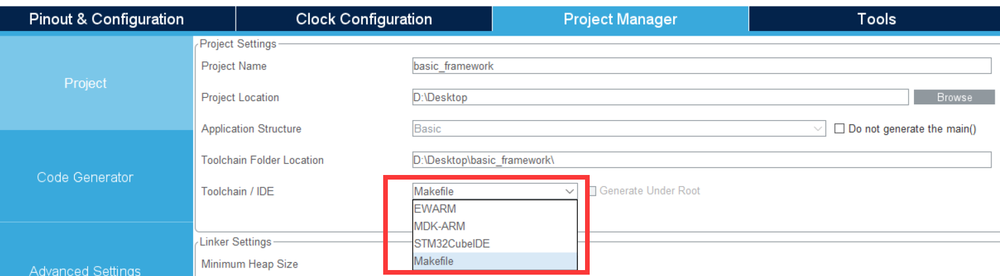

  生成的目录结构如下：

  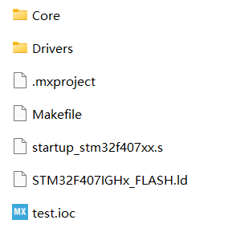

  CMakeLists.txt 就是我们要使用的构建规则文件。

  > **如果你使用basic_framework，不需要重新生成代码。**

- **建议将ozone和jlink的目录一同加入环境变量，方便我们后续的一键下载和一键调试配置**

## VSCode编译和调试配置

VSCode常用快捷键包括：

| 功能                   | 快捷键        |
| ---------------------- | ------------- |
| 选中当前行             | Ctrl+L        |
| 删除当前行             | Ctrl+Shift+K  |
| 重命名变量             | F2            |
| 跳转到定义             | Ctrl+点击     |
| 在打开的文件页中切换   | Ctrl+Tab      |
| 在当前文件查找         | Ctrl+F        |
| 在整个项目文件夹中查找 | Ctrl+Shift+F  |
| 查找所有引用           | Alt+Shift+F12 |
| 返回上一动作           | Alt+左        |

更多快捷键可以按ctrl+K再按ctrl+S显示，并且可以修改成你最习惯的方式。此外，使用Snippets可以大幅度提高重复性的代码编写速度，它可以直接帮你补全一个代码块（如for、while、switch）；补全和snippet都使用`Tab`键接受代码提示的提议，通过↑和↓键切换提示。

### 编译

CMake 会根据 CMakeLists.txt 递归收集参与编译的源文件和头文件目录，并调用 arm-none-eabi-gcc 完成编译、链接和格式转换。推荐使用 Ninja 生成器：

```shell
cmake -S . -B cmake-build-debug -G Ninja
cmake --build cmake-build-debug
```

如果本机没有安装 Ninja，可以去掉 `-G Ninja` 使用 CMake 默认生成器。构建完成后，输出目录中会生成 `basic_framework.elf`、`basic_framework.hex`、`basic_framework.bin` 和 `basic_framework.map`。

迁移说明：本工程从此只支持 CMake，原根目录 Makefile 和 Makefile.upgrade 已删除；新增多文件时无需手工维护旧构建脚本，CMake 会递归收集工程源文件。

由于使用了并行构建，比 KEIL 的单线程构建要快不少。.elf 文件就是我们需要传递给调试器的东西，在[使用VSCode调试](###简单调试)部分会介绍。典型的编译时间大致如下：

1. 从零开始重新编译：~10s
2. 修改文件后编译：~3s

当然了，你可能觉得每次编译都要在命令行里输入参数，太麻烦了。我们可以编写一个`task.json`，这是VSCode的一个任务配置，内容大致如下：

```json
{
    // See https://go.microsoft.com/fwlink/?LinkId=733558
    "version": "2.0.0",
    "tasks": [
        {
            "label": "build task",
            "type": "shell",
            "command": "cmake",
            "args": ["--build", "cmake-build-debug"],
            "problemMatcher": [],          
            "group": {
                "kind": "build",
                "isDefault": true
            }
        }
    ]
}
```

这样，你就可以点击VSCode工具栏上方的Terminal->Run task选择你刚刚配置的任务开始编译了。**更方便的方法是使用快捷键：`ctrl+shift+B`。** 之后要配置下载任务和调试任务等，也可以利用这种方法，新建一个xxx_task，实现一键下载、一键调试等。

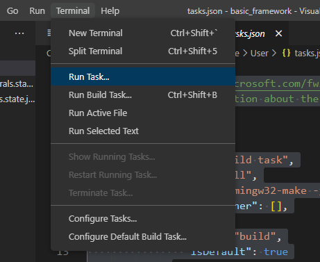

> 还没配置任务的时候，需要在Terminal标签页中选择Configure Tasks... 创建一个新的.json文件。
>
> P.S. VSCode中的大部分配置都是通过json文件保存的。当前工作区的配置在项目文件夹中的.vscode下，全局配置在设置中修改。全局配置在当前工作区没有配置的时候会生效，反之被前者覆盖。

### 如果你编写了新的代码文件

只要新的 `.c` 文件位于 `Src/`、`Drivers/`、`Middlewares/`、`bsp/`、`modules/` 或 `application/` 目录下，CMake 会在重新配置时递归收集它。新增头文件目录同理，放入这些目录后会被递归加入包含路径。

如果构建系统没有立刻发现新文件，请重新执行一次：

```shell
cmake -S . -B cmake-build-debug -G Ninja
cmake --build cmake-build-debug
```

### 简单的调试配置

> 在VSCode中调试不能像Keil一样查看变量动态变化，但是支持以外的所有操作，如查看外设和反汇编代码，设置断点触发方式等。
>
> **用于调试的配置参考这篇博客**：[Cortex-debug 调试器使用介绍](https://blog.csdn.net/qq_40833810/article/details/106713462)，这里包含了一些背景知识的介绍。你也可以直接查看下面的教程。

> ❗❗❗***==注意==***❗❗❗
>
> **如果你的用户名是中文，请先按照[附录6](##附录6：Windows修改用户名为英文)将自己的用户名改成英文。**

你需要配置**arm gnu工具链的路径**（工具链包括编译器、链接器和调试器等），**OpenOCD的路径**（使得GDB调试器可以找到OpenOCD并调用它，从而连接硬件调试器如j-link等），**JlinkGDBServer**的路径，以及该工作区（文件夹）的**launch.json文件**（用于启动vscode的调试任务）。

VSCode `ctrl+,`进入设置，通过`搜索`找到cortex-debug插件的设置。

1. 搜索**armToolchainPath**，设置你的arm gcc toolchain的`bin`文件夹。bin是binary的缩写，实际上文件夹内部是一些可执行文件，整个工具链都在这里（注意该文件夹是刚刚解压的**arm gcc toolchain的根目录**下的bin文件夹，里面有很多以arm-none-eabi为前缀的可执行文件)。此路径必须配置。
2. 搜索**openocdPath**，设置你的openocd路径（需要包含到openocd的可执行文件）。使用daplink调试需要配置这个路径。
3. 搜索**JLinkGBDServer**，设置JlinkGDBServerlCL.exe的路径（在Jlink安装目录下，CL代表command line命令行版本）。使用jlink调试需要配置这个路径。

**注意**，windows下路径需要使用两个反斜杠`\\`代表下一级文件夹。

> 如果你使用附录5中的方法安装，前两个的路径都在Msys2/mingw64/bin下。

***其他配置需要的文件已经全部在basic_framework中提供***，包括`openocd.cfg  STM32F407.svd  .vscode/launch.json`。

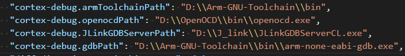

<center>主要需要配置这三个路径，第四个gdbPath可以选配</center>

如果教程中的启动json文件看不懂，请看仓库里的`.vscode`下的`launch.json`，照葫芦画瓢。注意把我写的路径替换掉或注释掉。`launch.json`已经添加了详细的注释。

根目录下已经提供了C板所需的.svd和使用无线调试器时所用的openocd.cfg配置文件。

然后选择run and debug标签页，在选项中选择你配置好的选项，开始调试。**或者使用快捷键：`F5`。**

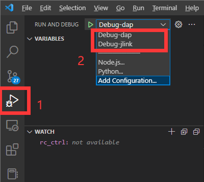

我们的仓库中默认提供了两种下载器的支持，dap-link（无线调试器属于这一种）和j-link（包括小的j-link OB和黑色大盒子jlink）。

### 调试介绍

开始调试后，显示的界面如下：

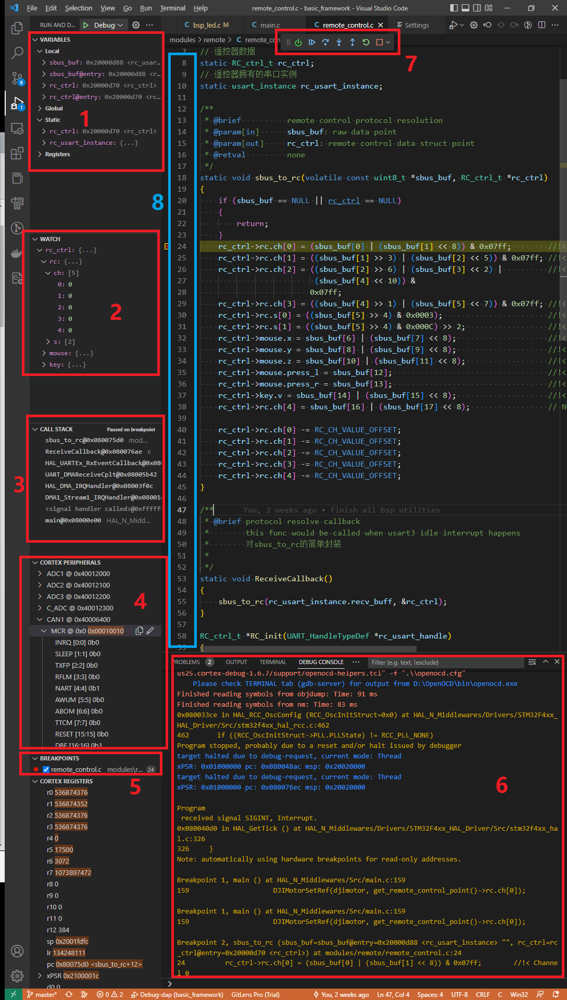

1. 变量查看窗口，包括当前调用栈（当前作用域或代码块）内的局部变量、当前文件的静态变量和全局变量。register选项卡可以查看cpu内核的寄存器数值。

2. 变量watch窗口。右键单击要查看的变量，选择watch加入查看。

   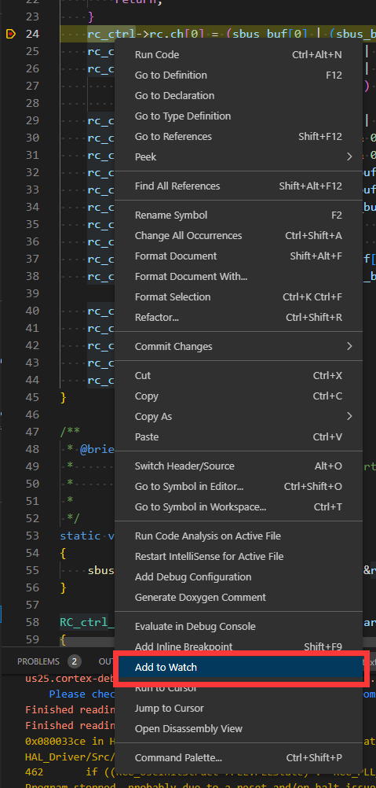

   还支持直接运行到指针所选处（Run to Cursor）以及直接跳转到指针处执行（Jump to Cursor）。添加行内断点（若一个表达式由多个表达式组成）也是很方便的功能，可以帮助进一步定位bug。

   右键点击添加到watch窗口的变量，**可以临时修改它们的值。**调参的时候非常好用。

   VSCode提供的一个最大的便利就是，你可以将鼠标悬停在需要查看的变量上，**不需要添加到watch就能观察变量值。**如果是指针还可以自动解析，获取解引用后的值。结构体也支持直接展开。

   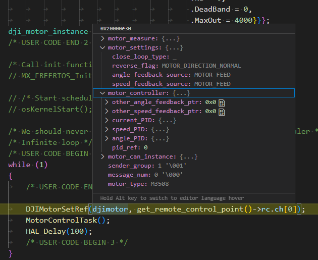

   > **现在Cortex-Debug插件也已经支持live watch（变量动态监视）**，最高可设置的刷新频率为4Hz，足堪大用，我们可以宣告KEIL的时代已经落幕！但是更复杂，更高频率的变量观测以及可视化功能还是需要通过ozone完成。

3. 调用栈。表明在进入当前代码块之前调用了哪些函数，称之为栈也是因为调用的顺序从下至上。当前函数结束之后栈指针会减小，控制权会返还给上一级的调用者。通过调用栈可以确认程序是**如何**（按怎样的顺序）运行到当前位置的。

4. 片上外设。这里可以查看外设的**控制寄存器**和**状态寄存器**的值，如果通过断点无法定位bug，则需要查找数据手册和Cortex M4指南的相关内容，根据寄存器值来判断程序当前的情况。

5. 断点。所有添加的断点都会显示于此，注意，不像我们自己的电脑，单片机的DBG外设对断点的数量有限制（资源所限），超过5个断点会导致debug失败，此时将断点减少即可。由于单行代码编译之后可能会对应多条汇编指令，或一条表达式由多个表达式构成，你还可以插入**行内断点**以逐个执行表达式或汇编语句，你还可以在汇编窗口插入断点调试汇编代码，帮助你发现错误。

   对于不方便判断何时需要停止代码执行进行观察和测试的情况，你可以右键行号左侧的断点栏插入条件断点，输入表达式，当表达式满足时才会进入断点。

6. 调试控制台。调试器输出的信息会显示在这里，要**查看**和**追踪**的变量的信息也会显示在这里。如果调试出现问题，报错信息同样也会在这里显示。要是出现异常，可以复制这里的信息在搜索引擎里查找答案，不过最好的方法是查询gdb和openocd的官方文档。

7. 调试控制。

   - 复位：单片机复位
   - 继续运行/暂停
   - 单步跳过，如果这一行有函数调用，不会进入内部
   - 进入，如果这一行有函数调用，会进入函数内部
   - 跳出，跳出当前调用栈顶层的函数，即如果在函数内部会直接运行到return
   - 重启调试器（当然单片机也会复位，一般出现异常的时候使用这个按钮）
   - 终止调试

> **如果你希望在编译之后立刻启动调试**，不要分两次点击，你可以在`launch.json`中添加一个`prelaunchtask`（意为在启动调试之前要运行的任务），将他设置为我们在[编译章节](###编译)介绍的构建任务。我们已经提供了这个选项，取消注释即可使用。
>
> 如果你想在VSCode中也使用segger RTT viewer的功能（即bsp_log提供的日志功能），请参阅[附录2](##附录2：在VSCode中启用SEGGER RTT日志)。
>
> 如果想直接下载代码不想调试，参阅[附录4](##附录4：VSCode直接烧录代码)。

### RTT Viewer日志功能

> 2023/07/23：补充，Cortex-Debug插件最近似乎集成了RTT Viewer的支持，只需要设置好RTT client的路径，便可以一键启动RTT终端，查看串行调试器中发送的内容。还支持以一定的格式将RTT发来的内容进行可视化（示波器），但支持程度不如Ozone。可以自行查看插件的wiki和文档进行配置。

本框架添加了vscode下Segger RTT client的支持。在`.vscode/task.json`中已经添加了启动rtt viewer client的任务。你也可以将此任务作为附加启动任务和调试一起启动，方便查看日志。要使用日志，请包含`bsp_log.h`。注意，需要将jlink的安装目录添加到环境变量中。

### 更好的编辑体验

建议安装以下插件：

1. Hex Hover Converter，鼠标悬停在数值上的时候会自动显示其对应的16、2、10进制值和编码

2. Hex Editor，在查看汇编代码和机器代码的时候，提供2、10、16进制转换，并且可以以16进制或2进制的格式编辑文件。

3. GitLens和git graph，提供强大的可视化commit记录和UI支持

4. Blockman - Highlight Nested Code Blocks 此插件会高亮嵌套的代码块（即花括号包围的部分或for/while/ifelse代码块），对于多层条件和循环嵌套效果非常炸裂

5. bookmark 提供代码中插入书签的功能，从而快速在页面间跳转。

6. Code Issue Manager，为团队提供issues和todo管理，方便协同开发

7. github copilot：超强，超快，需要一些小钱（10块用一年！你也可以在github上申请student pack，需要学信网认证和学生卡，但有一定概率无法通过） 在插件中你也可以找到一些免费的copilot替代品。推荐配合copilot labs一起使用，其支持解释选中代码、修复选中代码中的bug、增加选中代码可读性、提高选中代码的稳定性等功能，可以在你编写完代码后，根据之前的代码记录和你的编写习惯，高效地重构/优化/debug你的代码，还可以一键生成文档和注释！（文档仅作参考，你还是需要修改它自动以提高准确性）

8. `ctrl+k ctrl+s`配置属于你的快捷键，提高效率！

9. live share，和你的小伙伴一起结对编程

---

---

## Ozone可视化调试和LOG功能

> ~~Ozone暂时只支持jlink。~~
>
> 22/11/16**重要更新**：安装Ozone3.24 32-bit和J-Link7.22b目前可以支持Jlink和**dap-link（包括ATK无线调试器）**

### 软件安装

安装Ozone和J-link工具箱（驱动、gdb以及各种调试工具）。安装包都在网盘里。

**注意，如果希望支持daplink（包括正点原子无线调试器），请务必安装网盘对应的版本（Ozone3.24 32-bit和J-Link7.22b）。**

> 经过测试发现只有32位的ozone3.24支持daplink。

应该先安装Ozone，再安装jlink。以下为步骤：

1. 安装Ozone

   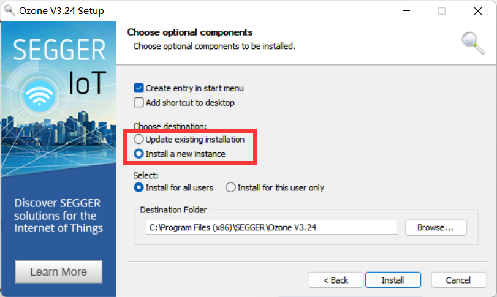

   这一步注意选择install a new instance（安装一个新的实例）。后续一路确认即可。

2. 安装jlink

   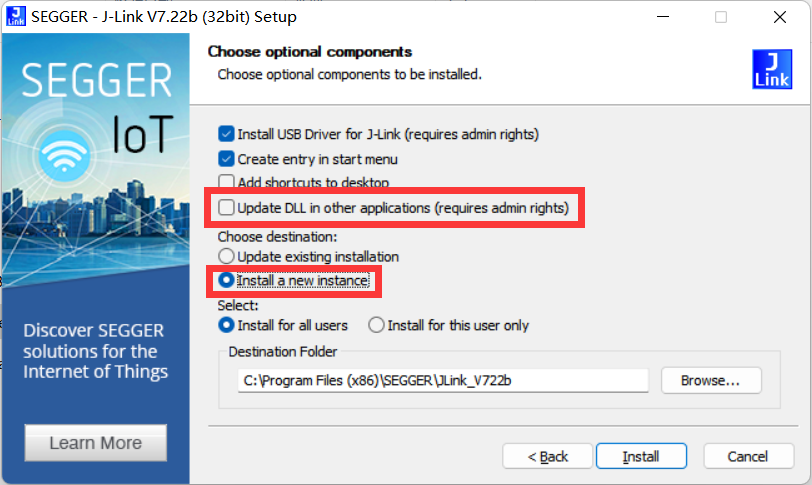

   这一步注意不要勾选update dll in other application，否则jlink会把ozone里面老的驱动和启动项替代掉。choose destination和ozone一样，选择install a new instance。如果安装了老的相同版本的jlink，请先卸载（版本相同不用管，直接新装一个）。

3. **替换动态链接库**

   **将网盘上下载的`JLinkARM.dll`放到JLink和Ozone的安装目录下，替换原来的库。下载下来的库经过修改，使得J-LinkOB在使用的时候不会报“The JLink is defective"和”you are using a clone version“的错误。**

   **之后如果安装其他版本的jlink，也请注意*==不要勾选==*update DLL in other application，否则会替换掉修改过的动态链接库。**

### 配置调试项目

安装好两个软件之后，打开ozone后会显示一个new project wizard，如果没有打开，在工具栏的File-> New -> New project wizard。

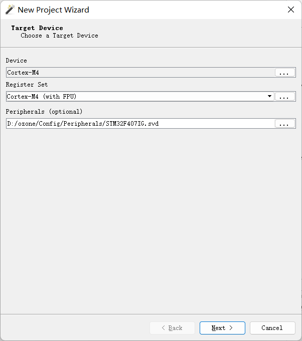

选择M4内核，为了能够查看外设寄存器的值还需要svd文件。所有mcu的svd都在图中的文件夹里提供，当然你也可以使用我们仓库根目录下的文件。

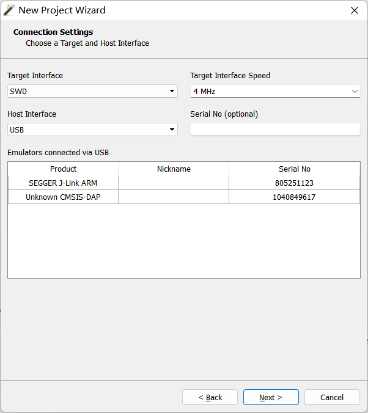

接口选择swd，接口速度不需要太高，如果调试的时候需要观察大量的变量并且使用日志功能，可以调高这个值。如果连接了jlikn，上面的窗口中会显示。如果链接了dap-link，比如无线调试器，会出现Unknown CMSIS-dap。选择你要使用的调试器，然后继续。

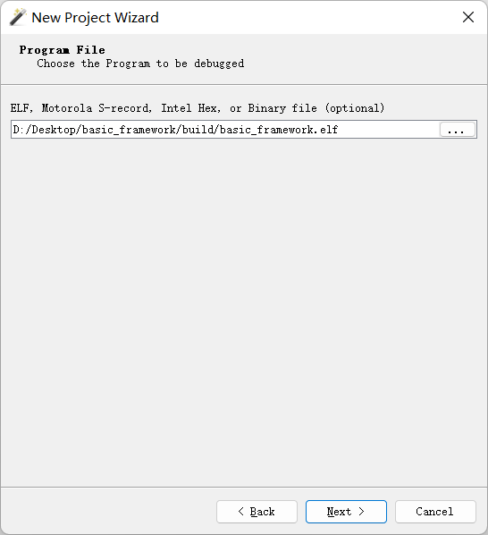

选择构建之后生成的.elf文件（在项目文件夹下的build中）。这是调试器专用的文件格式，对其内容感兴趣可以自行搜索细节。此外ozone还支持.bin .hex .axf（最后一个是amr-cc，也就是keil的工具链会生成的）等格式。

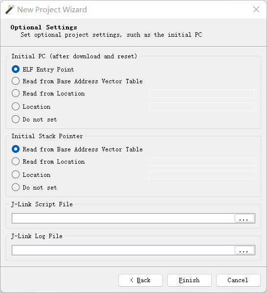

这页不要动。如果希望保存jlink的调试日志，最后一个选项选择一个文件或者新建一个日志文件。

### 启用FreeRTOS支持

注意，如果你的代码使用了实时系统，在载入项目的时候Ozone会进行对应的提示。选择载入支持实时系统的插件即可。

如果没有提示，请在console中输入下面的命令然后回车即可：

```shell
Project.SetOSPlugin(“plugin_name”)
# plugin_name是启用的实时系统支持插件名
# 我们要使用的命令是Project.SetOSPlugin ("FreeRTOSPlugin_CM4")
```

支持的插件在Ozone的安装目录下的`Plugins/OS`目录：

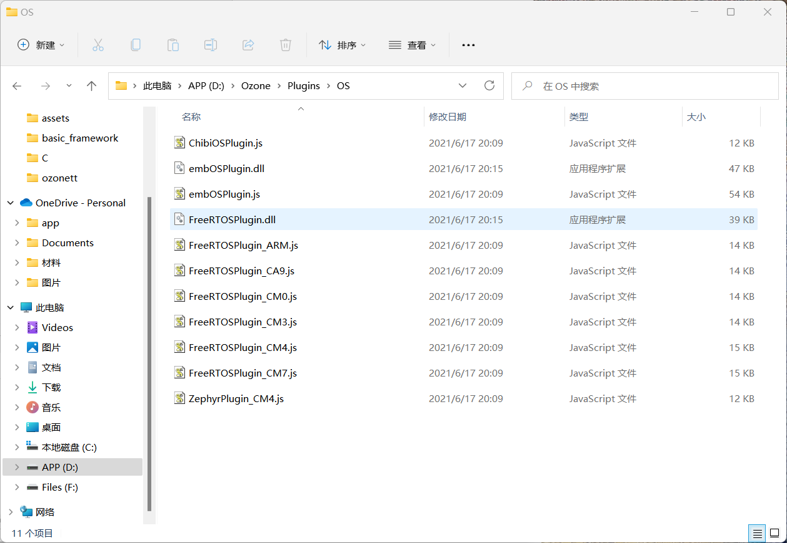

我们的项目是F4的板子，内核时Cortex-M4（CM4），因此选用`FreeRTOSPlugin_CM4.js`（输入的时候js后缀不用输）。 ozone默认输入的命令似乎有误，需要手动修改（这好像和ozone的版本有关，请留意）

### 常用调试窗口和功能

下图的配置是笔者常用的layout。每个窗口是否显示、放在什么位置等都是可以自己定义的。通过工具栏的view选项卡可以自行选择需要展示的窗口。

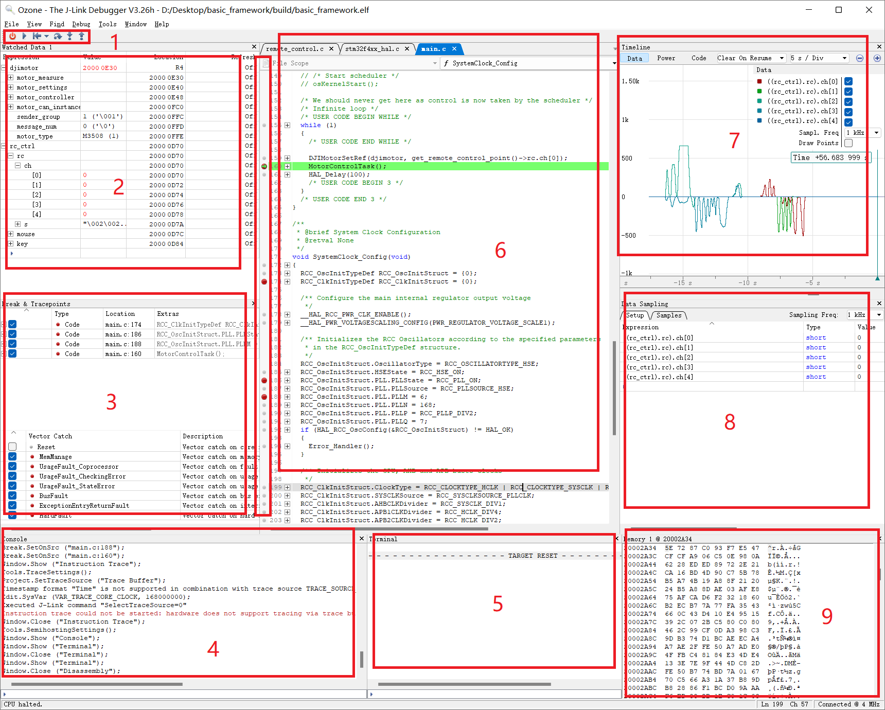

1. 调试控制：和vscode类似

2. 变量watch窗口，这里的变量不会实时更新，只有在暂停或遇到断点的时候才会更新。若希望实时查看，在这里右键选择需要动态查看的变量，选择Graph，他就会出现在**窗口8**的位置。

   如果不需要可视化查看变量变化的趋势，但是想不暂停查看变量的值，请右键点击变量，选择一个合适的refresh rate：

   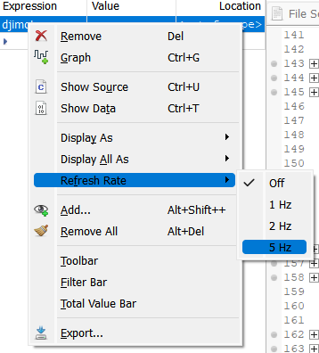

   如果是一个结构体，你可以为整个结构体都进行刷新率的配置，不需要手动一个个修改。**或直接右键点击窗口**，将refresh打勾：

   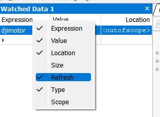

3. 断点和运行追踪管理

4. 调试控制台，输出调试器的信息。

5. 终端，支持一些jlink script的命令。**单片机通过log模块发送的日志也会显示在这里。**

6. 代码窗口，用于添加断点、添加查看等。鼠标悬停在变量上可以快速查看变量值和类型。希望打开整个项目文件，点击工具栏的view选项卡，单击Source Files就可以打开一个项目中所有源文件的窗口。右键点击函数或变量可以跳转到定义和声明、查看汇编代码等。按**F12**跳转到定义。

7. **变量可视化窗口，这就是Ozone的大杀器。**在变量添加到查看（watch）之后，右键点击watch中的变量选择Graph，变量会被添加到可视化查看中。你可以选择“示波器”的显示时间步长以及颜色等信息，还可以更改采样率。

   **注意，如果添加到动态调试窗口中没有反应，请在窗口8中修改一下”Sample Freq“为100Hz或200Hz即可**。

8. 窗口8和7配合。在窗口8中会实时显示变量值，并且统计平均值和最大最小值，**而且还会将所有采样值保存到一个csv文件当中**，如果需要进一步分析可以导出这个数据文件。若要进行系统辨识、前馈设计等，这无疑是最好的方法。这还可以方便我们观察采样值的异常，进一步提升debug的效率。

9. 内存视图。可以直接查看任意内存位置的值。

> 再次注意，这些窗口是否开启以及位置都是可以自定义的。
>
> **另外，如果使用dap-link，调试过程中可能会反复提示没有license，请查阅[附录1](##附录1：为daplink添加license)获取解决方案。**

如果在调试过程中发现bug或者需要更改代码，不需要终止调试或者关闭窗口。直接前往vscode修改并重新编译，Ozone会自动检测到.elf文件的变化，询问你是否重新加载项目。选择是后会自动开始下载并进入调试。

- **变量动态查看（可视化）**

  - **在变量的watch窗口右键点击变量，选择一个refresh rate也可以实时查看变量（和keil一样）。**

  - 如果没有打开窗口，现在view->timeline中打开可视化窗口。动态变量查看的窗口也在view->data sampling。

    启用动态变量查看的流程如下：

    ```mermaid
    graph LR
    在代码窗口中选中需要观察的变量 --> 添加到watch窗口 --> 在watch选择要动态查看的变量 --> 添加到Datasample窗口
    ```

    第一步的快捷键是`ctrl+w`，选中变量之后按。

    第二部的快捷键是`ctrl+g`，选中watch中的变量后按。

    第三步可以修改示波器的步长和采样频率。

  - 如果当前文件没有你要的变量，你想查看项目中的其他文件夹，在view-> source files中可以打开该项目所有的源文件，双击可以打开源文件。

    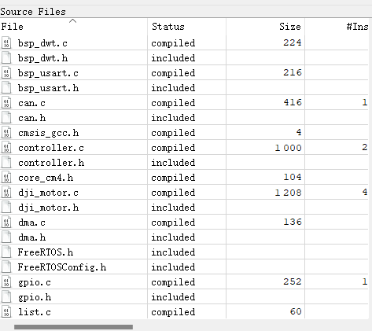

- **日志打印**

在Terminal窗口查看，还可以通过命令直接控制单片机的运行（不过不常用）。

未打开窗口则在view-> terminal中打开。使用bsp_log打印的日志会输出到该窗口中.

- **外设查看**

在view-> register中打开窗口，选择Peripherals可以查看所有外设寄存器

CPU选项卡可以查看CPU的寄存器。

- **调用栈**

在view-> call stack中打开窗口。

### 常用快捷键

| 组合                 | 功能                                                 |
| -------------------- | ---------------------------------------------------- |
| ctrl+w               | 添加到查看                                           |
| ctrl+g               | 添加到动态查看（需要先添加到查看）                   |
| f12                  | 跳转到定义                                           |
| f5                   | 启动调试                                             |
| f10                  | 单步跳过                                             |
| f11                  | 单步进入                                             |
| shift+f11            | 单步跳出                                             |
| 右键+break on change | 当变量发生变化的时候进入此断点                       |
| ctrl+H               | 展示调用图，会列出该函数调用的所有函数（内部调用栈） |

如果你使用拥有多个按键的鼠标,推荐将侧键前设置为ctrl+点击以查看声明/定义,侧键后设置为添加到watch(debug),侧滚轮设置为前进后退(历史)

你还可以按ctrl+K ctrl+S进入快捷键设置页面,将tab设置为下一个提示,用enter接受intelliSense建议,这样不需要将手移出主键盘区域. 将ctrl+;设置为移动到行尾,同时打开c/c++的函数括号不全,这样不需要手动敲击括号.

将alt+k设置为左移,alt+l设置为右移,这样不需要方向键.

选择最适合自己的配置!

### 保存调试项目

退出时可以将调试项目保存在项目的根目录下，方便下次调试使用，不需要重新设置。可以为jlink和daplink分别保存一套调试配置。

## 附录1：为daplink添加license

在网盘上下载`daplink_register_license.rar`，解压出来之后打开。**请关闭杀毒软件。**

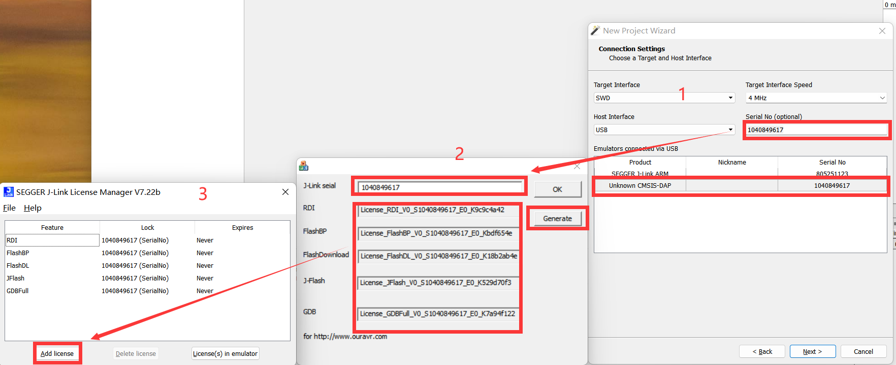

根据Ozone打开时提示的daplink的序列号，将其输入注册机，电机generate，就会生成5个license。

windows菜单搜索J-link license manager，点击添加license，将注册机生成的五个license依次复制黏贴并添加到的license manager中即可。

## 附录2：在VSCode中启用SEGGER RTT日志

若使用Jlink进行调试，只需要在开始调试之前把`log`任务启动，便可以在终端中看到jlink rtt viewer的日志输出。

若使用daplink/cmsis-dap调试，**请使用Jlink调试任务启动**，并且在**调试任务启动之后再打开`log`任务**。

`bsp_log.h`中提供了不同的日志输出接口，包括封装好的三种层级的日志（info warning error），和用户可以自定义输出格式的`PrintLog()`。还提供了一些简单的将浮点数据转化为字符串的函数方便进行日志输出。

## 附录3：CMake 构建说明

CMakeLists.txt 会统一描述编译器、芯片架构、FPU、链接脚本、CMSIS-DSP 链接库、源文件递归收集规则和烧录目标。常用命令如下：

```shell
cmake -S . -B cmake-build-debug -G Ninja
cmake --build cmake-build-debug
cmake --build cmake-build-debug --target flash_dap
cmake --build cmake-build-debug --target flash_jlink
```

核心构建参数包括：

- `arm-none-eabi-gcc`：C 和 ASM 编译器。
- `CMAKE_C_STANDARD 11`：使用 C11。
- `-mcpu=cortex-m4 -mfloat-abi=hard -mfpu=fpv4-sp-d16`：面向 Cortex-M4F 和硬浮点。
- `STM32F407IGHx_FLASH.ld`：链接脚本。
- `libCMSISDSP.a`：CMSIS-DSP 静态库。
- `CMSIS_RTOS_V2/cmsis_os2.c`：CMSIS-RTOS v2 wrapper。

CMake 会生成 `basic_framework.elf`、`basic_framework.hex`、`basic_framework.bin` 和 `basic_framework.map`。如果新增 `.c` 文件或头文件目录，重新配置一次即可让递归收集规则生效。

- **编译优化等级**:

| 优化级别 | 说明                                             | 备注                                                         |
| -------- | ------------------------------------------------ | ------------------------------------------------------------ |
| -O0      | 关闭所有优化                                     | 代码空间大，执行效率低                                       |
| -O1      | 基本优化等级                                     | 编译器在不花费太多编译时间基础上，试图生成更快、更小的代码   |
| -O2      | O1的升级版，推荐的优化级别                       | 编译器试图提高代码性能，而不会增大体积和占用太多编译时间     |
| -O3      | 最危险的优化等级                                 | 会延长代码编译时间，生成更大体积、更耗内存的二进制文件，大大增加编译失败的几率和不可预知的程序行为，得不偿失 |
| -Og      | O1基础上，去掉了那些影响调试的优化               | 如果最终是为了调试程序，可以使用这个参数。不过光有这个参数也是不行的，这个参数只是告诉编译器，编译后的代码不要影响调试，但调试信息的生成还是靠  -g 参数的 |
| -Os      | O2基础上，进一步优化代码尺寸                     | 去掉了那些会导致最终可执行程序增大的优化，如果想要更小的可执行程序，可选择这个参数。 |
| -Ofast   | 优化到破坏标准合规性的点(等效于-O3 -ffast-math ) | 是在 -O3 的基础上，添加了一些非常规优化，这些优化是通过打破一些国际标准（比如一些数学函数的实现标准）来实现的，所以一般不推荐使用该参数。 |

## 附录4：VSCode直接烧录代码

有时候你对自己的代码特别自信，不想 debug 想直接下载代码，可以通过 CMake 自定义目标调用 OpenOCD。根目录已经提供 `openocd_dap.cfg` 和 `openocd_jlink.cfg`，对应命令如下：

```shell
cmake --build cmake-build-debug --target flash_dap
cmake --build cmake-build-debug --target flash_jlink
```

两个目标都会先依赖 `basic_framework.elf`，构建产物更新后再烧录。OpenOCD 命令中，`-c` 表明启动后要执行的命令；这里在 `flash write_image` 之后直接 `reset` 让单片机复位开始运行程序，然后立刻退出调试，从而达到下载程序运行但不调试的目的。

在 tasks.json 中可以添加如下两个任务：

```json
 {
     "label": "download dap",
     "type": "shell",
     "command": "cmake",
     "args": ["--build", "cmake-build-debug", "--target", "flash_dap"],
     "group": {
      "kind": "build",
      "isDefault": false,
      },
 },
 {
     "label": "download jlink",
     "type": "shell",
     "command": "cmake",
     "args": ["--build", "cmake-build-debug", "--target", "flash_jlink"],
     "group": {
         "kind": "build",
         "isDefault": false,
         }
 },
```

这样，在工具栏的 Terminal 页面，就可以选择对应的任务直接下载执行了。你也可以通过快捷键 `ctrl+shift+B` 唤起任务执行页面进行选择。对于调试，如果想在修改代码之后直接调试，可以在 launch.json 中保留 `preLaunchTask`。

> 实际上换用arm gnu工具链之后，可以指定多线程编译，因此消耗的时间非常短，建议都加上先编译的选项，不会占用额外的时间。可以把默认task设置成编译后下载，把默认debug设置成编译后调试，提升开发效率。

## 附录5：利用MSYS2安装依赖环境

之所以要使用Linux进行C++开发，是因为在开发环境中配置依赖包、依赖应用和库非常的方便。Debian系有apt，Fedora和Redhat系有yum，他们都可以方便地帮助我们下载开发软件必须的一些文件和工具。在windows的宇宙最强IDEVisual Studio中配置头文件和动态链接库可以称得上是最折磨的事。好在，现在Windows下也有可以使用的包管理工具了：[MSYS2](https://www.msys2.org/)。

安装包已经上传到了网盘的`EC/VSCode+Ozone环境配置/msys2-x86_64-20221028.exe`下，你也可以在msys2的官网直接下载，如果没有ladder速度可能会稍慢，镜像站的下载速度会快许多。安装之后，打开MSYS2 MSYS软件，他是一个类shell的界面，实际上它提供了包括mingw64、ucrt64、clang64等多种不同编译环境在内的一组类linux开发工具合集：

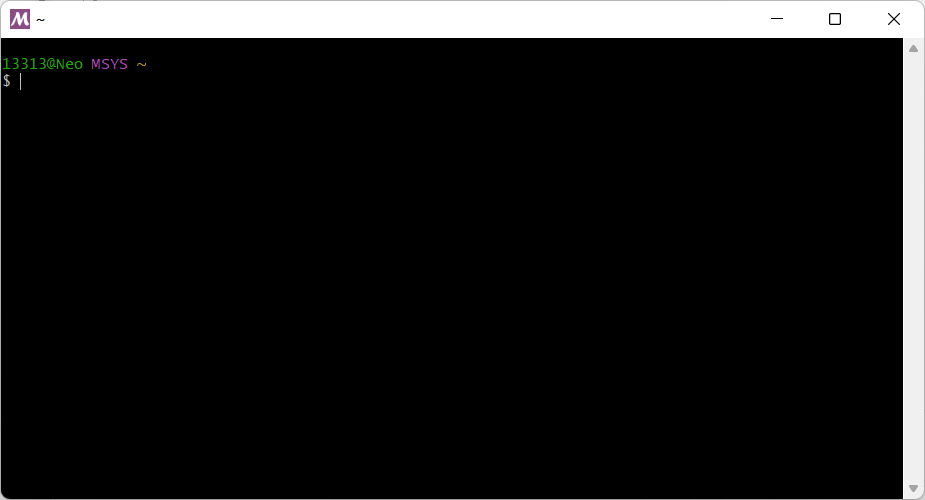

输入以下命令然后一路回车即可：

```shell
pacman -S mingw-w64-x86_64-toolchain mingw-w64-x86_64-arm-none-eabi-toolchain mingw-w64-x86_64-ccache  mingw-w64-x86_64-openocd
# 需要注意ctrl+V不是黏贴快捷键,而是Ins+Shift.或者右键点击空白处选择黏贴也可以.
```

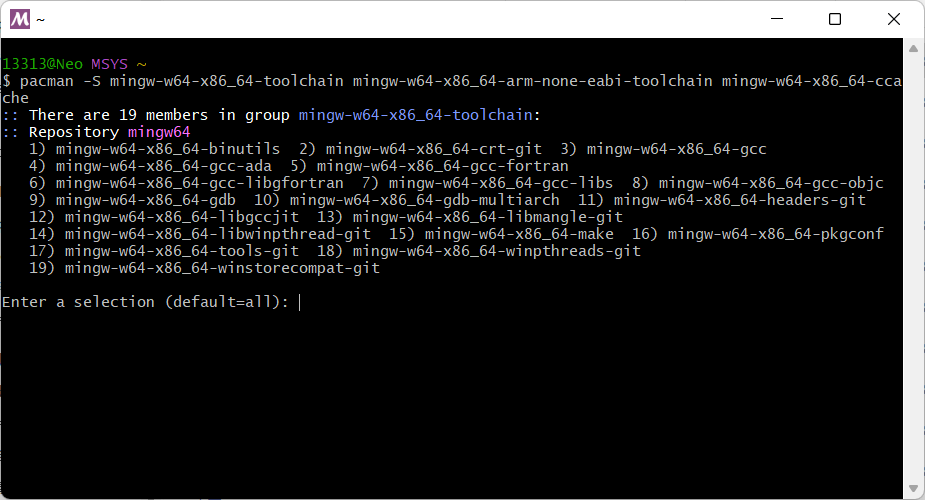

<center>比如上面这样，会让你选择，直接敲回车即可，等待安装</center>

刚进来第一次安装可能还会更新一下数据库，也是全部更新就行。

安装好之后，把Msys2下的mingw64的bin加入PATH环境变量：`D:\Msys2\mingw64\bin`（这是我的路径，注意要选自己的）。

注意，如果选用此安装方式，**OpenOCD的可执行文件也会被放在上面这个路径下**，记得稍后在VSCode中配置的时候找到这里。相应的scripts放在`D:\Msys2\mingw64\share\openocd`下。

通过这种方式安装之后，还可以选用 ccache 加速编译。ccache 会根据之前的编译输出建立缓存，使得之后编译时可以直接读取缓存。若要启用它，请在 CMake 工具链或 CMakeLists.txt 中配置编译器启动器。


- **将msys2的各种终端集成到vscode当中**

当你的系统中存在各种不同的编译环境时，将他们的路径一同添加到系统环境变量PATH中可能导致错误的工具和指令调用，也有可能在编译中匹配错误的库和头文件。为了防止这种事情发生，最好是只在特定的工具集中添加它们需要的环境变量。Msys2提供了各种子环境的终端（shell），你可以将它们集成到Vscode的终端中，当要进行对应的开发时，就新建一个你需要的环境的终端。

`ctrl+,`打开vscode设置或直接打开vscode设置的.json文件，添加以下内容便会将对应的环境终端集成在vscode中：

```json
  "terminal.integrated.defaultProfile.windows": "mysys2-mingw64", // 若希望为默认终端可以加入这一句
  "terminal.integrated.profiles.windows": {
    "mysys2-mingw64": {
      "path": "cmd.exe", // 意思是使用cmd作为父进程启动终端
      "args": ["/c","C:\\msys64\\msys2_shell.cmd -defterm -mingw64 -no-start -here"]
        // msys2_shell.cmd在msys的安装目录下，这里要改为你自己的目录
    }
  }
```

修改好之后，便可以在vscode中使用了：

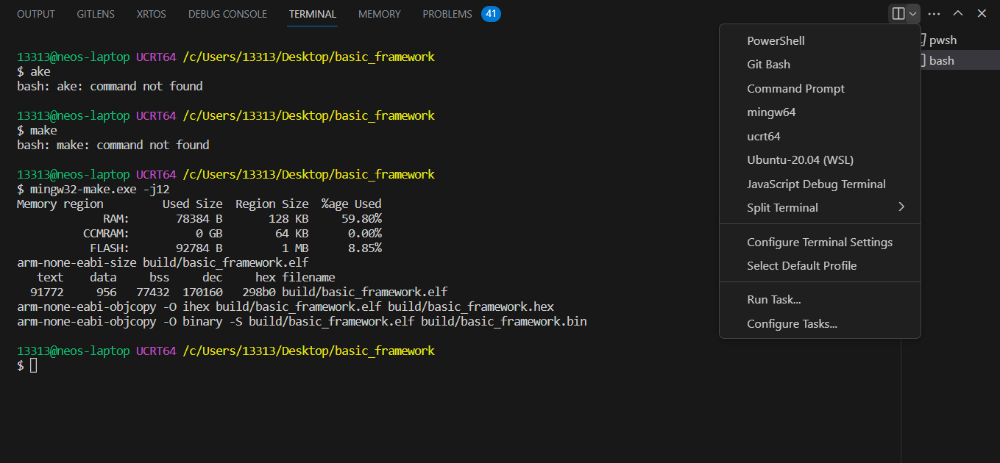

linux下熟悉的ls/mkdir/find/ld/cat等命令和工具也一应俱全了。

不过，这时配置的build task和其他download task仍然在powershell或cmd中启动，若没有添加环境变量它们无法找到对应的可执行文件，这时候你就要修改`task.json`，将使用的shell改为mingw64即可（若你使用ucrt或clang同理）。

## 附录6：Windows修改用户名为英文

1. 右键【任务栏win徽标】->【计算机管理】->【本地用户和组】->【用户】->右键【中文用户名】->【重命名】

   > 如果是win10，则是：右键【计算机（一般放在桌面上，如果没有的话桌面右键选择个性化，然后打开桌面图标）】->【管理】->【本地用户和组】->【用户】->右键【中文用户名】->【重命名】

   **注意这个英文用户名后续还要使用**

2. **以管理员权限**启动命令提示符，输入

   ```shell
   net user administrator /active:yes
   ```

   如果杀毒软件提示恶意修改，请放行

3. 重启电脑，登录的时候选择**Administrator**账户，需要进行一些简单的设置，直接一路确定即可。

4. 进入C盘的用户文件夹下，把你原来的用户文件夹名称改成刚刚设定的英文用户名。

5. 【Windows+R】->【运行】->输入 regedit ->回车

   找到`HKEY_LOCAL_MACHINE\SOFTWARE\Microsoft\Windows NT\CurrentVersion\Profilelist`，把这个标签页下每个选项都点开看，其中有一个页面对应的`ProfileImagePath`值是以你用户名命名的文件夹路径，比如我的路径是`C:\User\小曾`。

   双击，把这个路径改成你新设的用户名，比如我的`C:\User\Neo`

6. 重启电脑，进入修改好的用户，

7. **以管理员权限**启动命令提示符，输入

   ```shell
   net user administrator /active:no
   ```

   如果杀毒软件提示恶意修改，请放行。这会关闭Administator账户。
